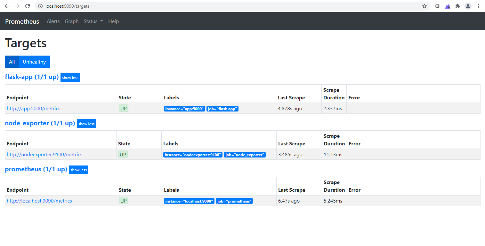
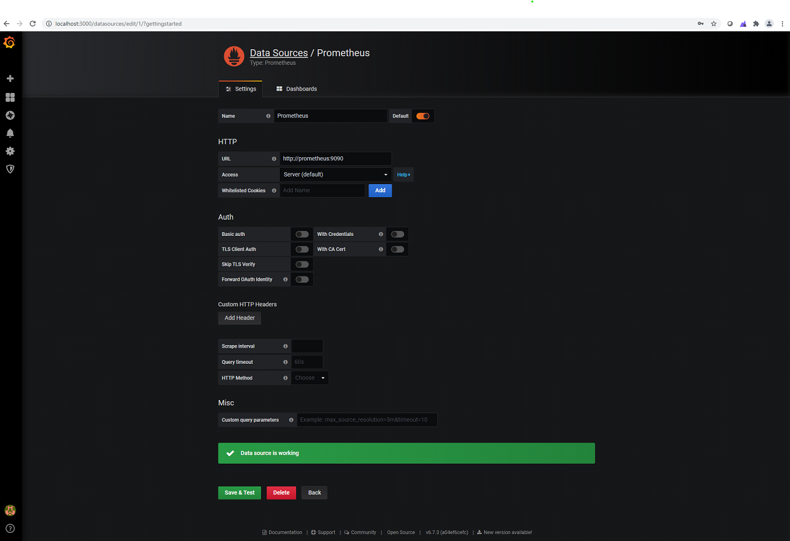

# Monitoring With Prometheus

Monitoring is important in DevOps practices for any successful company. It helps companies to get better understanding of the underlying systems. Prometheus is an open source tool for monitoring and alerting. It’s multi-dimensional data model and flexible query language is the key power in a world of microservices.

In this tutorial, we use 
- A simple flask application 
- Prometheus server for monitoring Flask application by instrumenting the source code and collect the custom metrics.
- Prometheus Node exporter for hardware and OS metrics exposed by *NIX kernels.
- Grafana for visualizing the metrics

# Pre-requisites
Before we get started installing the monitoring stack. Ensure you install the latest version of docker and [docker swarm](https://docs.docker.com/engine/swarm/swarm-tutorial/) on your Docker host machine. Docker Swarm is installed automatically when using Docker for Mac or Docker for Windows.

# Installation & Configuration
Clone the repo to your Docker host machine.

Instead of downloading each component used in this tutorial, we are running everything on docker containers. Docker compose is used for running multi-container applications. We just need to configure the different application services in a Yaml file called `docker-compose.yml`. Then with single command, we can easily start all the services.

If you want to make changes to the configuration edit [/prometheus.yml](/prometheus.yml) before starting the services.

You need to use the `docker-compose build` command first to build your app image from `/flask_app/Dockerfile`.  

    $ docker-compose build

Next, run the following command to start the stack. 

    $ docker-compose up

`docker-compose.yml` is configured with Prometheus, Node Exporter, Flask App and Grafana. Each application is built and run on a separate container. A local network is created for those containers in the docker-compose with the container_name as hostname.  

Prometheus server can be reached on http://localhost:9090/ 

`Localhost` is accessible from browser outside Docker. 

Grafana can be reached on http://localhost:3000/, default user is `admin` and the password you set in the compose file `GF_SECURITY_ADMIN_PASSWORD=secure_pass`. Choose the datasource(Prometheus) and configure it like below. You can create dashboard based on what you want to monitor.

